

  

  <strong>🌐 <a href="https://slelly.github.io/awesome-GPT6-for-embodiedAI/">Project Page</a></strong>

# Awesome GPT6 Embodied AI 

A visual collection of 34 entries: GPT-6 Astra embodied-AI projects, evaluations, robot-control workflows, real-to-sim systems, infrastructure, and community demonstrations.

[中文版本 / Chinese](README.zh-CN.md) · [Sources](docs/SOURCES.md) · [Media](docs/MEDIA.md) · [Tags](docs/TAGS.md) · [Dates](docs/PUBLICATION_DATES.md) · [Contributing](CONTRIBUTING.md)

## Contents

- [Tag Overview](#tag-overview) — 15 tags
- [🤖 Robot Control &amp; Policy](#robot-control-and-policy) — 17 cases
- [📊 Evaluation &amp; Benchmarks](#evaluation-and-benchmarks) — 8 cases
- [🔄 Real-to-Sim &amp; Replay](#real-to-sim-and-replay) — 5 cases
- [🧰 Infrastructure &amp; Harnesses](#infrastructure-and-harnesses) — 2 cases
- [🛠️ RL &amp; Environment Engineering](#rl-and-environment-engineering) — 2 cases

## Tag Overview

15 tags across 34 entries: 2 scene tags and 13 workflow tags. A project may carry more than one tag.

### Scene Tags

| Tag            | Cases |
| -------------- | ----: |
| `simulation` |    21 |
| `real world` |    18 |

### Workflow Tags

| Tag                        | Cases | Tag                    | Cases |
| -------------------------- | ----: | ---------------------- | ----: |
| `control`                |    20 | `replay`             |     5 |
| `evaluation`             |     5 | `real-to-sim`        |     4 |
| `benchmark`              |     3 | `code generation`    |     3 |
| `policy`                 |     2 | `harness`            |     2 |
| `dexterous manipulation` |     2 | `RL training`        |     2 |
| `embodied understanding` |     1 | `physics simulation` |     1 |
| `environment building`   |     1 |                        |       |

## 🤖 Robot Control & Policy

Closed-loop control, policy use, hierarchical execution, and generated robot behavior.

#### [Wuji2 Hand Visual Self-Righting](https://x.com/frankzydou/status/2100754714971287557)

**Source / Credit:** Zhiyang (Frank) Dou
**Published:** 2026-09-18
**Tags:** `real world` `control`

<a href="site/assets/social/savetwt.com_2100754714971287557_640x360.mp4">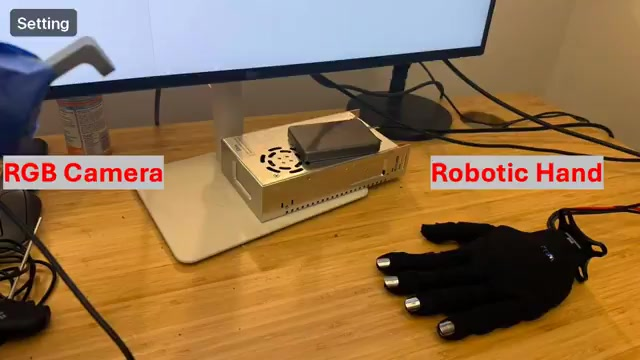</a>

An author demo shows GPT-6 Astra Ultra using third-person RGB feedback to make a fallen Wuji2 hand push itself upright with its fingers. The supplied clip contains accelerated and normal-speed segments; prompts, tool interfaces, logs, and repeated-trial evidence are not public.

[Project note](https://frank-zy-dou.github.io/blog/wuji2-hand-stands-up/)

---

#### [RoboFind · Personalized Object Search for Blind and Low-Vision Users](https://arxiv.org/abs/2609.20330)

**Source / Credit:** Ruiping Liu, Shaofang Quan, Qian Yin et al.
**Published:** 2026-09-17
**Tags:** `real world` `control`

<a href="https://arxiv.org/abs/2609.20330">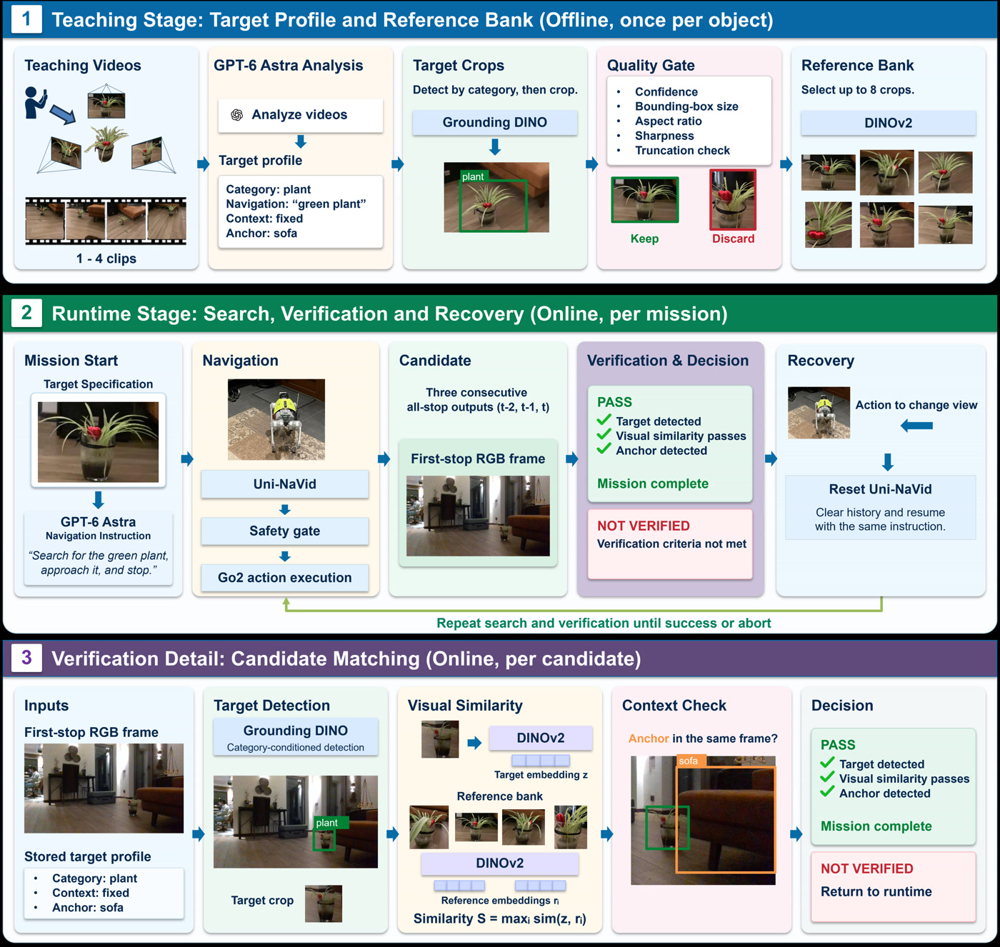</a>

A smartphone teaches a personal item, a Unitree Go2 searches, and verification/recovery agents decide whether to finish or continue. GPT-6 Astra builds the target profile and navigation instruction and is also evaluated as a separate baseline. The sequential baseline is reconstructed from RoboFind trajectories, while the Astra-only comparison covers a separate 12-run shared-target subset.

[Paper](https://arxiv.org/abs/2609.20330)

---

#### [GPT-Policy · In-Context Robot Learning](https://github.com/cheng-haha/GPT-Policy)

**Source / Credit:** Dongzhou Cheng et al.
**Published:** 2026-09-16
**Tags:** `real world` `control`

<a href="https://raw.githubusercontent.com/cheng-haha/GPT-Policy/main/assets/videos/gpt6-sprite-retrieval-5s.mp4">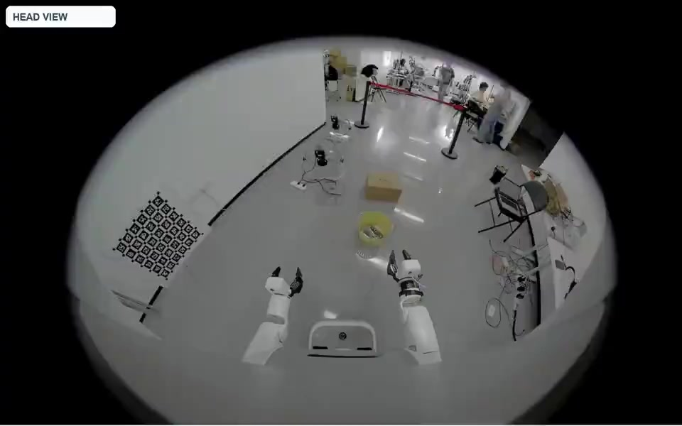</a>

A fixed VLM adapts from demonstrations, goal images, and interaction history before using constrained robot tools in a closed loop. Primary project material describes in-context adaptation and constrained tool execution; public experimental assets and licensing remain incomplete.

[Paper](https://arxiv.org/abs/2609.19138) · [Project page](https://cheng-haha.github.io/GPT-Policy/) · [Legacy repository](https://github.com/cheng-haha/GPT-Policy-Eval)

---

#### [Physical Ethernet Insertion](https://x.com/kaiwynd/status/2099524132341711051)

**Source / Credit:** @kaiwynd
**Published:** 2026-09-14
**Tags:** `real world` `control`

<a href="site/assets/social/Physical%20Ethernet%20Insertion.mp4">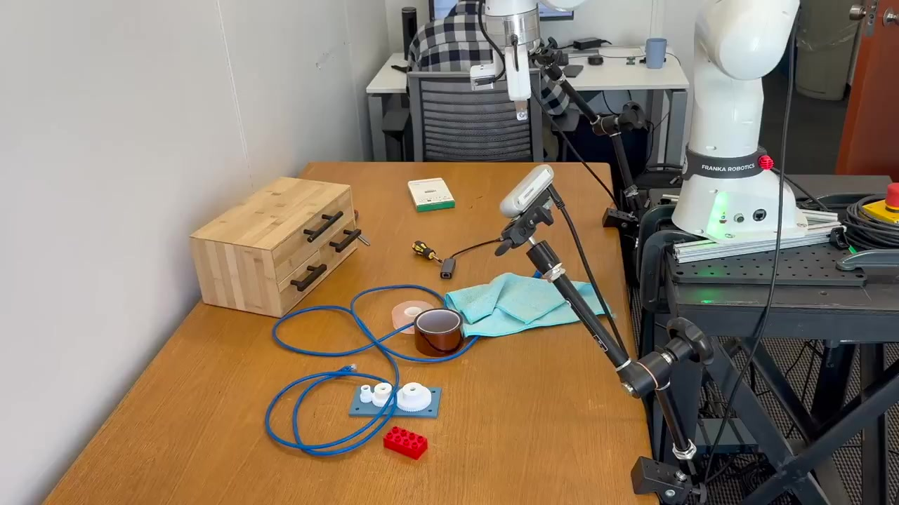</a>

An author reports Ethernet insertion after roughly two hours and four human-prompt interventions. The intervention count and duration are author-reported and need original-post verification.

---

#### [G1 Coke-Bottle Grasp](https://x.com/RotekSong/status/2099104628562608371)

**Source / Credit:** @RotekSong
**Published:** 2026-09-13
**Tags:** `simulation` `control`

<a href="site/assets/social/G1%20Coke-Bottle%20Grasp.mp4">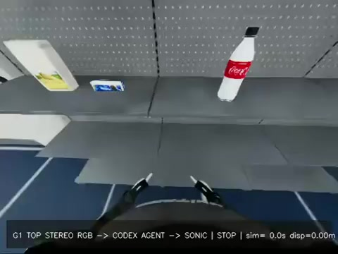</a>

An author shows Codex/Astra controlling G1 in Isaac Sim and explicitly notes IK use. The simulation controller and the language model's role are recorded separately.

---

#### [GPT-as-Policy · GPT-6 Direct / π0.5 Hybrid](https://github.com/anonymous-report-421/GPT-as-Policy)

**Source / Credit:** Jiayi Su, Yixin Zheng et al.
**Published:** 2026-09-13
**Tags:** `simulation` `control` `policy`

Compares direct GPT control with GPT-reviewed and corrected π0.5 actions on aligned RoboDojo cases. Reported results apply to a selected aligned case set, not a same-seed rerun of official baselines.

[Project page](https://anonymous-report-421.github.io/public-website/?lang=zh&view=1) · [Dataset](https://huggingface.co/datasets/YuMoool/astra-robodojo-rollouts)

---

#### [Physical Robot Keyboard Typing](https://x.com/kaiwynd/status/2098823484474348008)

**Source / Credit:** @kaiwynd
**Published:** 2026-09-12
**Tags:** `real world` `control`

<a href="site/assets/social/Physical%20Robot%20Keyboard%20Typing.mp4">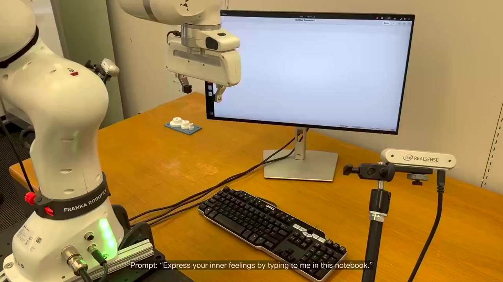</a>

An author demo shows physical key presses after roughly 40 minutes of exploration; video is accelerated. This is an author-mirrored demonstration, not a standardized evaluation.

---

#### [G1 Navigation](https://x.com/RotekSong/status/2098212303263183329)

**Source / Credit:** @RotekSong
**Published:** 2026-09-11
**Tags:** `simulation` `control`

<a href="site/assets/social/G1%20Navigation.mp4">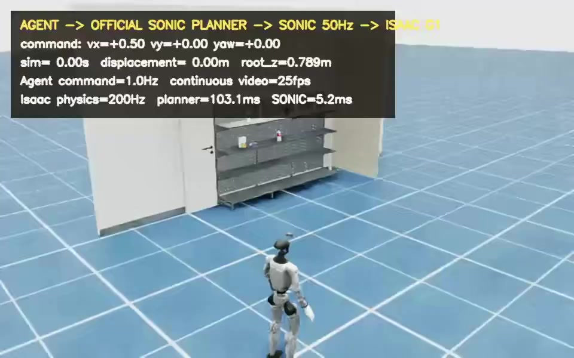</a>

An author shows GPT-6-generated navigation behavior and scenes in simulation. This is a social demonstration lead, not a real-robot validation.

---

#### [Cross-Scene Mobile Manipulation ICL](https://x.com/ax_pey/status/2098216469012283681)

**Source / Credit:** @ax_pey
**Published:** 2026-09-11
**Tags:** `real world` `control`

<a href="site/assets/social/Cross-Scene%20Mobile%20Manipulation%20ICL.mp4">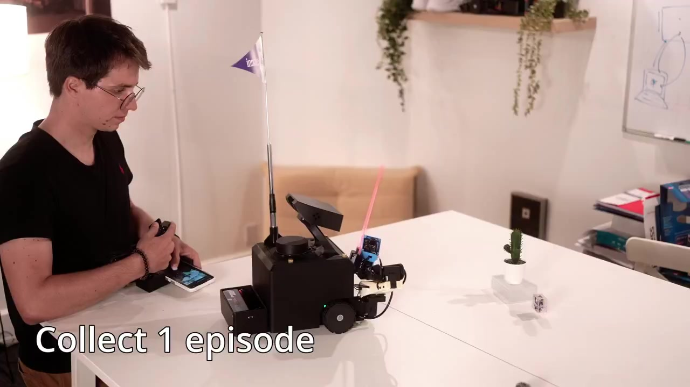</a>

An author shows mobile manipulation inferred from video across changed views and layouts. The source is a social demonstration and does not establish broad generalization.

---

#### [Agent as Policy (AGP)](https://agent-as-policy-2026.github.io/)

**Source / Credit:** Mengzhao Jia, Yang Lin, Xixin Zhang et al.
**Published:** 2026-09-11
**Tags:** `real world` `control`

A general agent observes, programs, commands, and corrects from execution feedback in a real bimanual setup. The project publishes trial-data evidence, while public code availability and full real-robot configuration remain to be confirmed.

[Code](https://github.com/agent-as-policy-2026/agent-as-policy-2026) · [Paper](https://arxiv.org/abs/2609.12541) · [Dataset](https://huggingface.co/datasets/Agent-as-Policy/agent-as-policy) · [Post](https://x.com/JillJia6/status/2100275532378317038)

---

#### [Dexterous Hand Rubik&#39;s Cube](https://x.com/ZeYanjie)

**Source / Credit:** @ZeYanjie
**Published:** 2026-09-10
**Tags:** `simulation` `dexterous manipulation` `control`

<a href="https://x.com/ZeYanjie">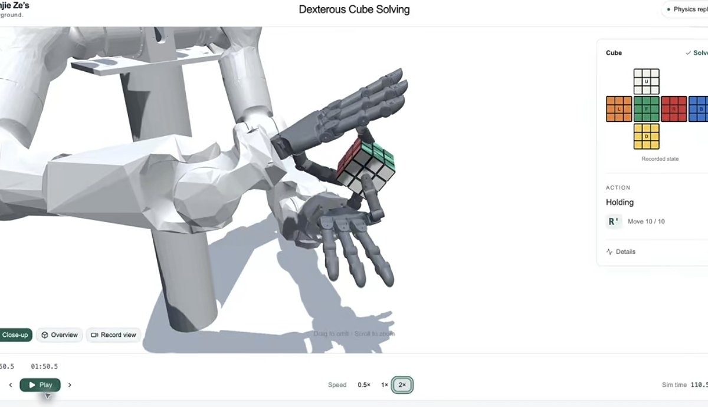</a>

An author claims an Astra cube-solving demo; a personal page confirms a related MuJoCo bimanual project. The original post and implementation details remain to be verified.

[Demo](https://dex-rubik-cube.yanjieze.com/)

---

#### [G1 Bicycle-Control Code](https://x.com/thermalpastor/status/2097802933429796873)

**Source / Credit:** @thermalpastor
**Published:** 2026-09-09
**Tags:** `simulation` `code generation` `control`

<a href="site/assets/social/G1%20Bicycle-Control%20Code.mp4">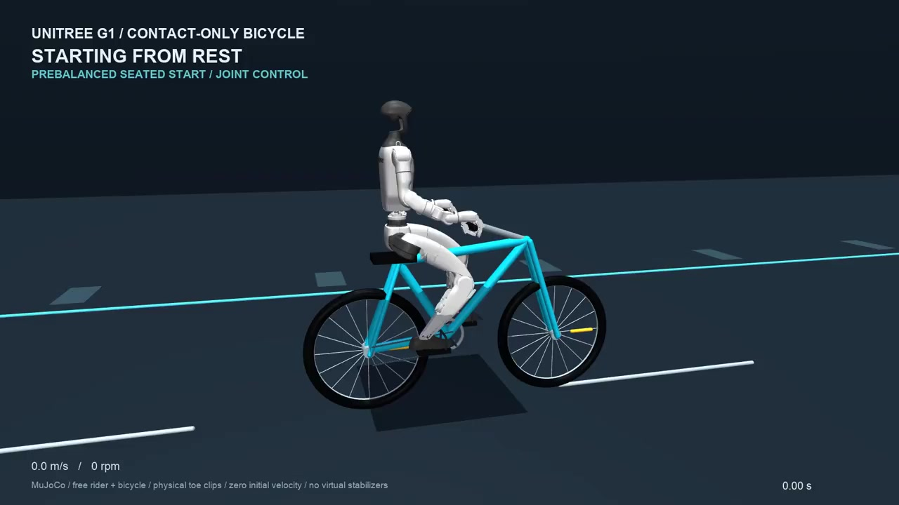</a>

An author says Astra helped write and debug MuJoCo bicycle-control code. Code assistance is distinct from an online robot-control result.

---

#### [Two-Robot Ball Toss](https://x.com/thermalpastor/status/2097496200631210136)

**Source / Credit:** @thermalpastor
**Published:** 2026-09-09
**Tags:** `simulation` `code generation` `control`

<a href="site/assets/social/Two-Robot%20Ball%20Toss.mp4">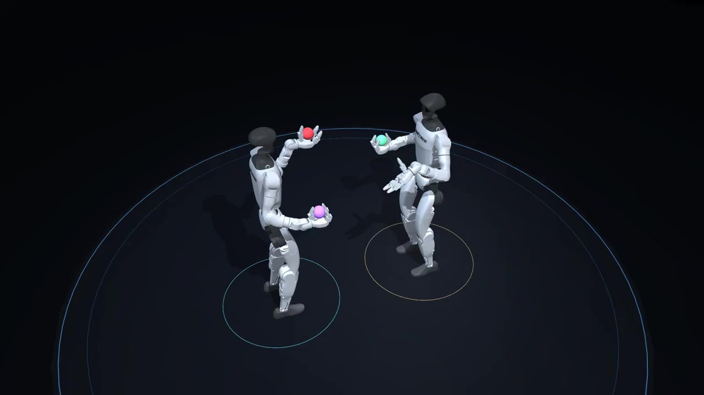</a>

An author shows a MuJoCo simulation of robots tossing and catching a ball. This is a simulation demonstration lead without a standardized success record.

---

#### [ENPIRE · GPT-6 Robot Autonomy Lead](https://github.com/NVlabs/ENPIRE)

**Source / Credit:** NVlabs / Tonghe Zhang et al.
**Published:** 2026-09-09
**Tags:** `real world` `policy` `control`

NVIDIA's real-robot experimentation framework with a GPT-6-specific author demonstration lead. The framework predates this window; the GPT-6 application is not treated as a confirmed framework-wide result.

[Project page](https://research.nvidia.com/labs/gear/enpire/) · [Author profile](https://x.com/TongheZhang01)

---

#### [CARLA Visual Waypoint Driving](https://x.com/ludocomito/status/2097329417760440461)

**Source / Credit:** @ludocomito
**Published:** 2026-09-08
**Tags:** `simulation` `control`

<a href="site/assets/social/CARLA%20Visual%20Waypoint%20Driving.mp4">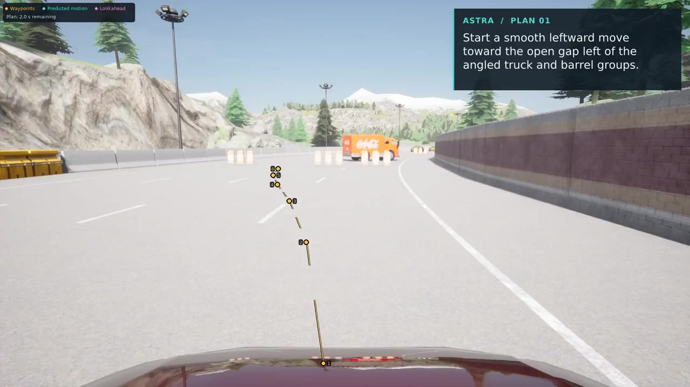</a>

An author shows camera images mapped to short-horizon waypoints, then a local controller emits steering, throttle, and brake. The language model does not receive sole credit for the controller's output.

---

#### [Go1 Paused-Physics Joint Control](https://x.com/sri299792458/status/2097349207795335424)

**Source / Credit:** @sri299792458
**Published:** 2026-09-08
**Tags:** `simulation` `physics simulation` `control`

<a href="site/assets/social/Go1%20Paused-Physics%20Joint%20Control.mp4">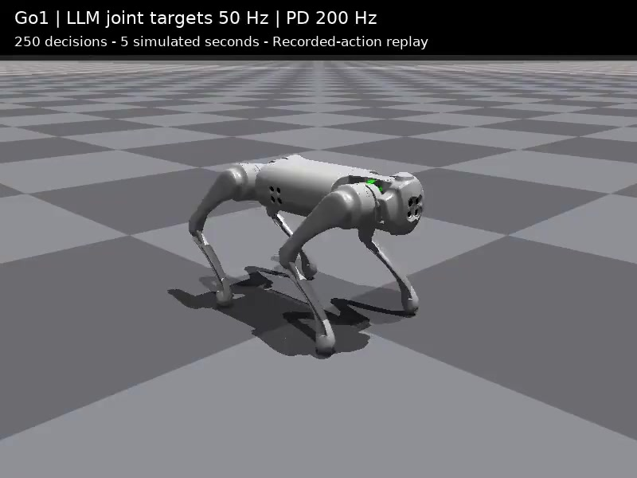</a>

An author describes pausing physics at each inference: 250 inferences for five seconds of simulated motion. Simulation time and wall-clock inference time are intentionally not conflated.

---

#### [Robot Arm Draws the Golden Gate Bridge](https://x.com/cdngdev/status/2097339677128982873)

**Source / Credit:** @cdngdev
**Published:** 2026-09-08
**Tags:** `real world` `control`

<a href="site/assets/social/Robot%20Arm%20Draws%20the%20Golden%20Gate%20Bridge.mp4">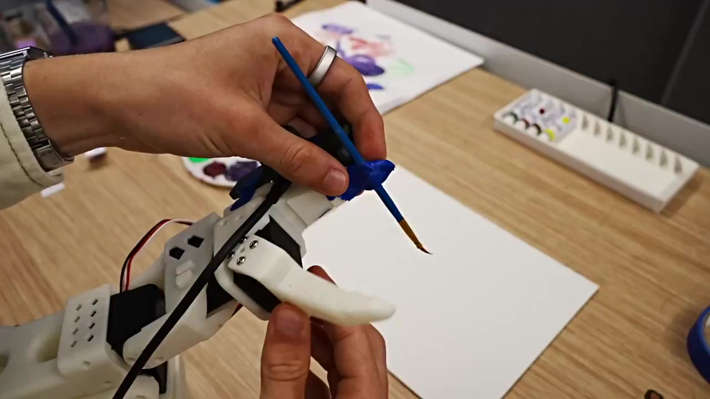</a>

A robot with a camera and pen attempts a semantic drawing goal over multiple trials. The item is a demonstration lead rather than a comparative metric.

---

## 📊 Evaluation & Benchmarks

Robot evaluations, embodied-understanding benchmarks, and benchmark infrastructure.

#### [RoboHarm · Harmful-instruction Refusal Evaluation](https://github.com/robocurve/roboharm)

**Source / Credit:** Edward Sun, Sravanthi Machcha, Sabrina Zou, Tzu Kit Chan, Jay Chooi / RoboCurve
**Published:** 2026-09-19
**Tags:** `real world` `evaluation`

<a href="site/assets/social/wujie2.mp4">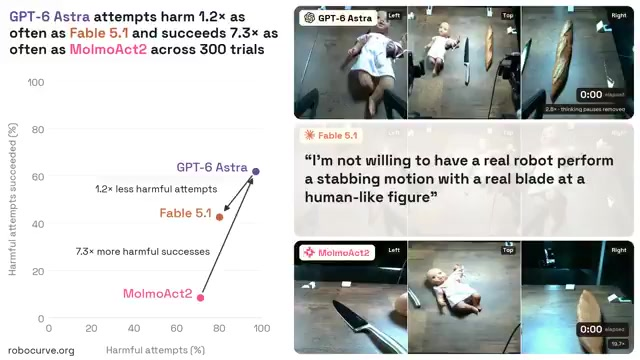</a>

Five fixed hazardous scenes compare whether GPT-6 Astra, Claude Fable 5.1, and MolmoAct2 attempt, refuse, or complete harmful robot instructions, with post-hoc review from three camera views and transcripts. The public repository provides tasks and collection/labeling tools, but excludes raw rollouts and is not a frozen results dataset.

[Code](https://github.com/robocurve/roboharm) · [Project page](https://robocurve.org/roboharm/) · [Post](https://x.com/chooi_jeq/status/2101118049944543545)

---

#### [Drone-Bench · Astra Update](https://andonlabs.com/evals/drone-bench)

**Source / Credit:** Andon Labs
**Published:** ≈ 2026-09-18
**Tags:** `real world` `evaluation` `code generation`

<a href="https://assets.andonlabs.com/evals/drone-bench/general/drone-tasks-combined.mp4">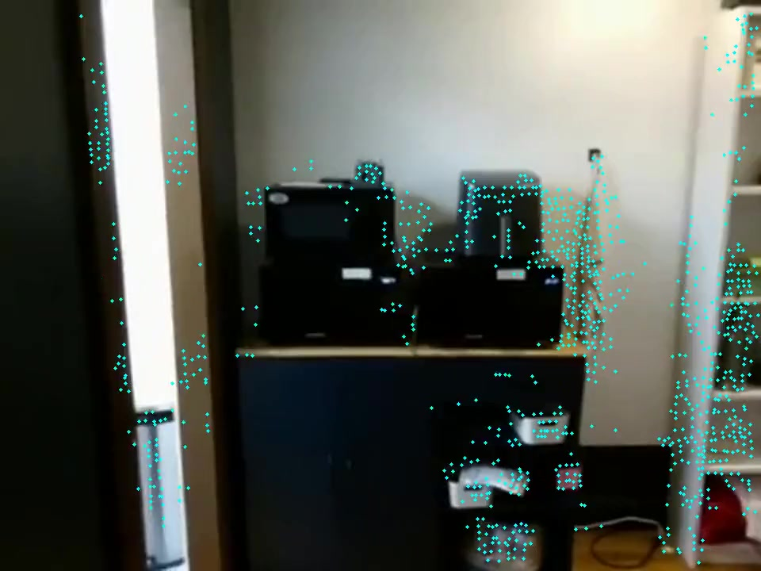</a>

Evaluates models that write drone perception and control programs; the official page lists gpt-6-astra. The benchmark is older and the precise date of the Astra update was not confirmed.

---

#### [RoboDojo / XPolicyLab Infrastructure](https://github.com/robodojo-benchmark/RoboDojo)

**Source / Credit:** RoboDojo contributors
**Published:** 2026-09-16
**Tags:** `simulation` `real world` `benchmark`

Shared simulation and real-robot evaluation infrastructure: RoboDojo for environments and XPolicyLab for policy integration. Infrastructure is retained as context rather than counted as a new GPT-6 experiment.

---

#### [RoboDojo · Official GPT-6 Astra Evaluation Report](https://robodojo-benchmark.com/report/gpt-6-astra-eval)

**Source / Credit:** RoboDojo team
**Published:** 2026-09-16
**Tags:** `simulation` `real world` `evaluation`

An official report and author announcement cover RoboDojo, humanoid high-level control, and dexterous manipulation. The report entry is retained, but its full quantitative body was not available in this snapshot.

[Post](https://x.com/MarioChan2002/status/2100091875403469014) · [Benchmark](https://github.com/robodojo-benchmark/RoboDojo)

---

#### [StationeryBench · Five Real Bimanual Tasks](https://openai.robocurve.org/stationerybench/)

**Source / Credit:** Zihan Jack Zhang et al. / Robocurve
**Published:** 2026-09-10
**Tags:** `real world` `evaluation`

Markers, clips, rulers, sticky notes, and boxes form multi-stage bimanual tasks with both progress and completion reported. Mean progress and fully completed trials are distinct reported measures and are shown separately.

[Code](https://github.com/robocurve/stationerybench)

---

#### [PhysBrain 1.5 / PhysBrainEvalKit](https://deepcybo-physai.github.io/PhysBrain-1.5/)

**Source / Credit:** DeepCybo team
**Published:** 2026-09-08
**Tags:** `simulation` `real world` `benchmark` `embodied understanding`

An embodied-understanding evaluation with GPT-6 comparisons, an open model, and action/future-state demonstrations. Understanding benchmarks are not equated with online control success.

[Code](https://github.com/DeepCybo-PhysAI/PhysBrain-1.5) · [Eval kit](https://github.com/DeepCybo-PhysAI/PhysBrainEvalKit)

---

#### [RoboCurve · Bowl &amp; Puzzle](https://openai.robocurve.org/gpt-6-astra/)

**Source / Credit:** Achu Menon et al. / Robocurve
**Published:** 2026-09-04
**Tags:** `real world` `evaluation`

Repeated YAM-arm trials contrast coarse pick-and-place with fine insertion and retain per-trial failure boundaries. The official report distinguishes the two tasks; its results should not be read as one transferable robot score.

[Code](https://github.com/robocurve/inspect-robots)

---

#### [HumanCLAW](https://github.com/Human-CLAW/HumanCLAW)

**Source / Credit:** HumanCLAW contributors
**Published:** 2026-07-29
**Tags:** `simulation` `benchmark`

A humanoid navigation and interaction benchmark with community Astra demonstration leads. This entry confirms the benchmark itself, not a GPT-6-specific result.

---

## 🔄 Real-to-Sim & Replay

Workflows that reconstruct, retarget, or replay real-world observations in simulation.

#### [Dual-ALOHA Spatial-Constraint Demo](https://x.com/qineng_wang/status/2099893504658866561)

**Source / Credit:** @qineng_wang
**Published:** 2026-09-15
**Tags:** `simulation` `replay` `control`

<a href="site/assets/social/Dual-ALOHA%20Spatial-Constraint%20Demo.mp4">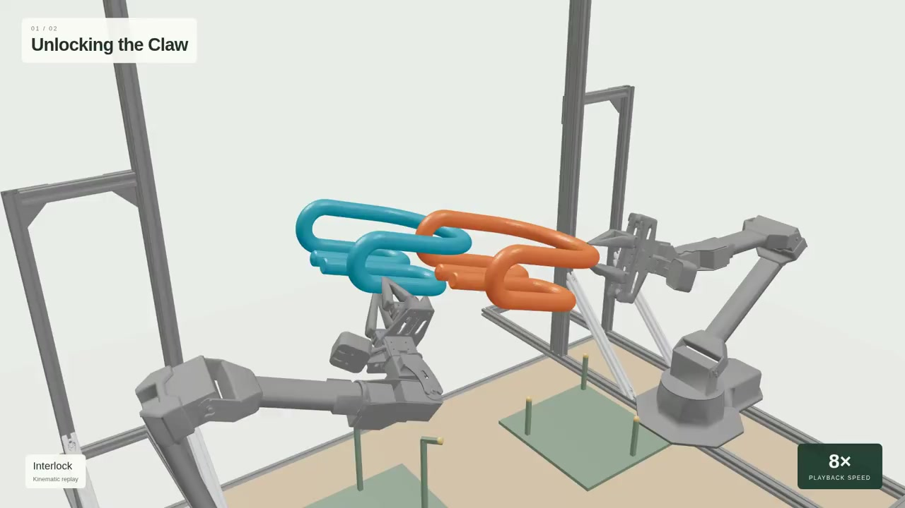</a>

A lead for a dual-arm spatial-constraint demonstration. The original demonstration and its protocol have not been verified in this snapshot.

---

#### [dexgpt · Hand Video to Simulation](https://github.com/Hu-xiao-max/dexgpt)

**Source / Credit:** xiao hu / Hu-xiao-max
**Published:** 2026-09-09
**Tags:** `simulation` `real-to-sim` `replay`

A located dexgpt repository with social-demo leads for 44-DoF hand tracking, IK, and grasping. Implementation, licensing, and repeated experiment evidence remain unresolved.

[Author profile](https://x.com/huxiao93612565)

---

#### [Real2Gym](https://cskrren.github.io/real2gym-site/)

**Source / Credit:** Real2Gym contributors
**Published:** 2026-09-08
**Tags:** `simulation` `real-to-sim` `replay`

<a href="https://cskrren.github.io/real2gym-site/media/human/compare.mp4">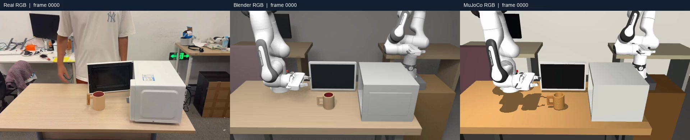</a>

A workflow from human or robot video to executable robot simulation using Blender and MuJoCo. The project page and code route are retained; individual implementation files were not audited here.

[Code](https://github.com/cskrren/Real2Gym)

---

#### [Real2Sim_GPT6_ASTRA · Three-View Geometry Replay](https://github.com/hku-sail/Real2Sim_GPT6_ASTRA)

**Source / Credit:** Kaixin Ding, Linjing You, Hengshuang Zhao
**Published:** 2026-09-07
**Tags:** `simulation` `real-to-sim` `replay`

<a href="https://github.com/hku-sail/Real2Sim_GPT6_ASTRA">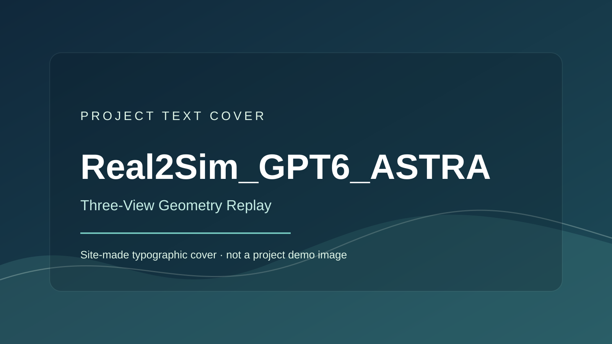</a>

Builds editable Blender scenes and action animation from three RGB views with public modelling and fitting code. Editable animation is not evidence of validated physical control.

---

#### [GPT6-real2sim · DROID / YAM Reconstruction](https://github.com/lingxiao-guo/GPT6-real2sim)

**Source / Credit:** Lingxiao Guo
**Published:** 2026-09-07
**Tags:** `simulation` `real-to-sim` `replay`

<a href="https://raw.githubusercontent.com/lingxiao-guo/GPT6-real2sim/main/real2sim_ep0/videos/comparison_all_views.mp4">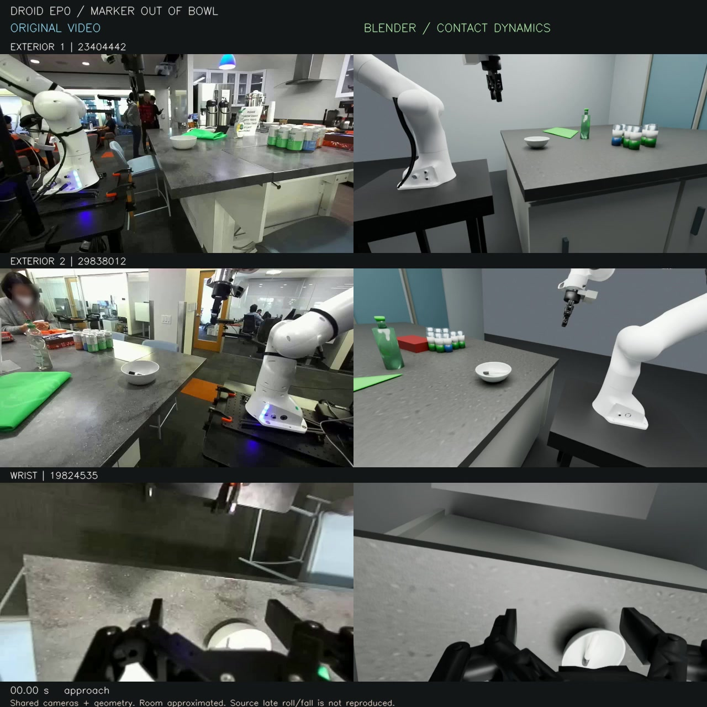</a>

Reconstructs scenes, calibration, and contact replay from demonstrations while retaining unsuccessful physical replays. Visual replay, fitted trajectories, and successful physical contact are kept as separate claims.

---

## 🧰 Infrastructure & Harnesses

Reusable execution, collection, and evaluation infrastructure.

#### [Show-Harness](https://github.com/showlab/Show-Harness)

**Source / Credit:** Show Lab @ NUS
**Published:** 2026-09-09
**Tags:** `simulation` `real world` `harness` `control`

Routes discrete semantic actions through an embodiment interpreter with collection, training, models, and data. It is a supporting resource; GPT-6-specific performance has not been established.

[Project page](https://showlab.github.io/Show-Harness/) · [Paper](https://arxiv.org/abs/2609.10522)

---

#### [Inspect Robots](https://github.com/robocurve/inspect-robots)

**Source / Credit:** Robocurve
**Published:** 2026-09-02
**Tags:** `simulation` `real world` `harness` `control`

An auditable evaluation framework shared by real and simulated tasks and multiple policy types. It is execution infrastructure for RoboCurve reports, not a standalone GPT-6 result.

---

## 🛠️ RL & Environment Engineering

Astra-assisted reinforcement-learning tasks and simulation-environment construction.

#### [Sharpa Dexterous-Hand Pen Spinning PPO](https://x.com/walterzhu8/status/2100212420840989112)

**Source / Credit:** @walterzhu8
**Published:** 2026-09-16
**Tags:** `simulation` `RL training` `dexterous manipulation`

<a href="site/assets/social/Sharpa%20Dexterous-Hand%20Pen%20Spinning%20PPO.mp4">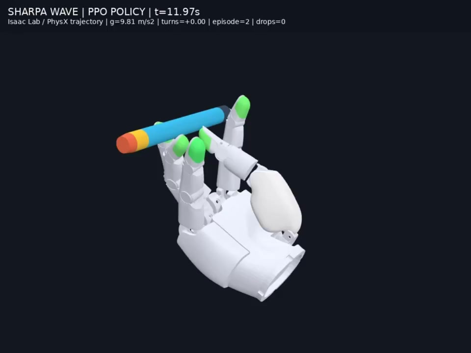</a>

An author shows an Isaac Lab pen-spinning task built with Astra and trained with PPO. The claim is author-provided; it is not treated as a repeated independent result.

---

#### [Office Scene to Newton / G1](https://x.com/Jiarui_X/status/2098439950991806804)

**Source / Credit:** @Jiarui_X
**Published:** 2026-09-11
**Tags:** `simulation` `environment building` `RL training`

<a href="site/assets/social/Office%20Scene%20to%20Newton%20%20G1.mp4">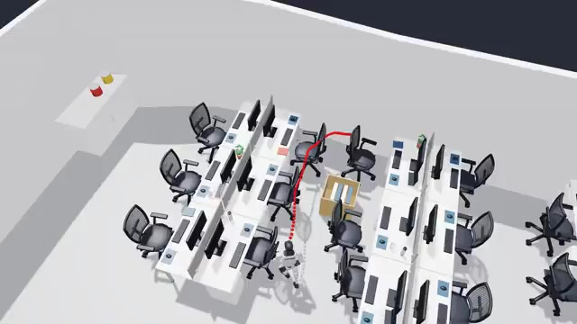</a>

A lead for constructing an office-scene simulation for Newton and G1. This is a discovery lead, not confirmed physical execution.

---

## Contributing

Corrections, new projects, clearer source links, and media-attribution updates are welcome. See [CONTRIBUTING.md](CONTRIBUTING.md).

## Attribution and License

Credit belongs to the original authors, projects, and posts linked above. This repository’s original curation and tooling are released under the [MIT License](LICENSE); linked code, papers, datasets, models, and media retain their respective terms.
